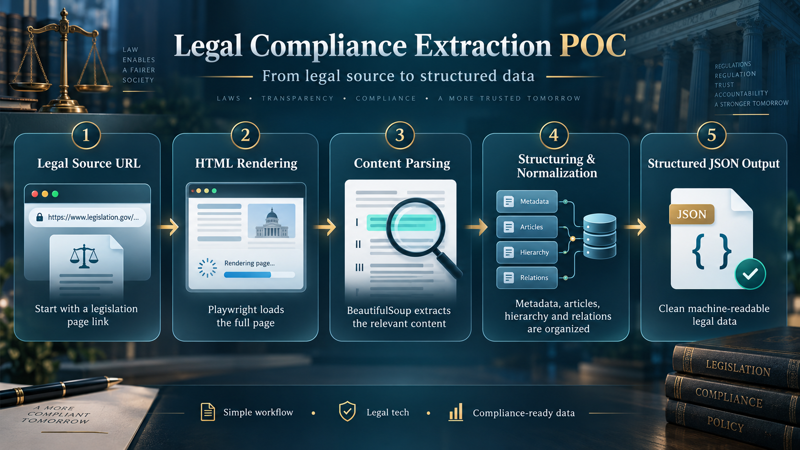

# Legal Scraping POC

A lightweight **Proof of Concept (POC)** for extracting Portuguese legislation from the **Diário da República (DRE)** and converting it into structured JSON.

## Overview

This project validates a simple legal data extraction pipeline:

`URL → Rendered HTML → Parsing → Structured JSON`

It detects the document source, renders the legislation page, extracts the relevant legal content, and organizes it into a structured JSON format.

## Process Illustration

## Tools Used

- **Python** – core application and orchestration
- **Playwright** – JavaScript page rendering and HTML extraction
- **BeautifulSoup** – HTML parsing and content extraction
- **Dataclasses** – structured legal document schema
- **JSON** – normalized output format

## Purpose

This repository is intended as a **POC to validate the legal extraction and normalization workflow**, not as a production-ready solution.